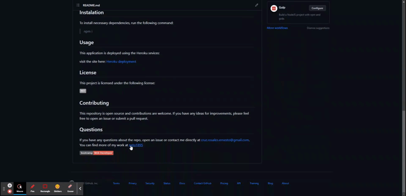

# M11C Note Taker Express.js ECR

## Description

This repository contains a Node.js application that can be used to write and save notes. This application use an Express.js back end and will save and retrieve note data from a JSON file.

## Table of Contents
- [ Walkthrough ](#walkthrough)
- [ Instalation ](#instalation)
- [ Usage ](#usage)
- [ License](#license)
- [ Contributing](#Contributing)
- [ Test ](#test)
- [ Questions ](#questions)

## Walkthrough

The following image demonstrates the functionality of the note taker: 

## Instalation

To install necessary dependencies, run the following command:

> npm i 

## Usage

This application is deployed using the Heroku sevices:

visit the site here: [Heroku deployment](https://mighty-mesa-81883.herokuapp.com/)

  
## License
    
This project is licensed under the following license:

## Contributing

This repository is open source with the starter code form the edeX bootcamp and contributions are welcome. If you have any ideas for improvements, please feel free to open an issue or submit a pull request.

## Questions

If you have any questions about the repo, open an issue or contact me directly at [cruz.rosales.ernesto@gmail.com](mailto:cruz.rosales.ernesto@gmail.com). You can find more of my work at [neto1895](https://github.com/neto1895)

